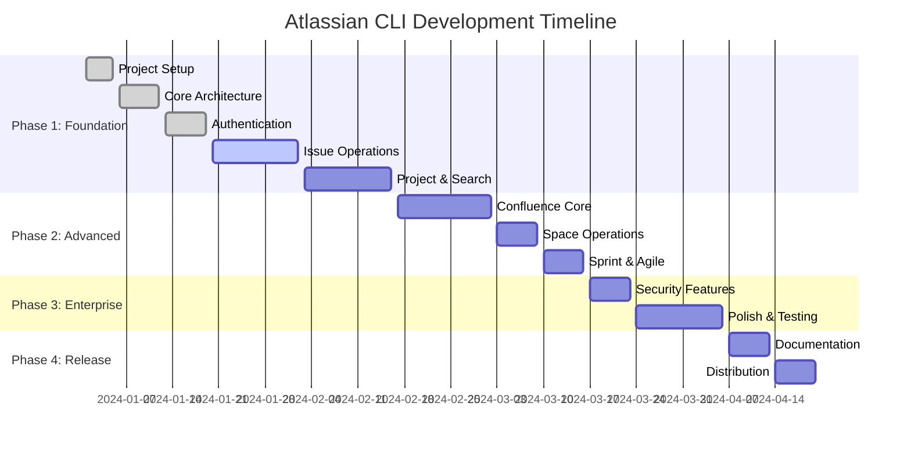

# Atlassian CLI Implementation Plan

## Executive Summary

This document outlines the comprehensive implementation plan for developing a production-ready Atlassian CLI tool that transforms JIRA and Confluence REST API complexity into intuitive developer workflows. The implementation follows proven architectural patterns from successful CLI tools like GitHub CLI, kubectl, and Docker CLI.

## Project Objectives

### Primary Goals
- **Developer Productivity**: Streamline common JIRA and Confluence operations into simple command-line workflows
- **Enterprise Readiness**: Implement secure authentication, robust error handling, and enterprise-grade reliability
- **Intuitive UX**: Provide command structures that match developer mental models and reduce cognitive overhead
- **Extensibility**: Create modular architecture supporting future API additions and custom workflows

### Success Metrics
- 50%+ reduction in time for common JIRA operations (issue creation, status updates, search)
- 100% API coverage for core developer workflows (issues, sprints, pages, spaces)
- Sub-500ms response time for local operations (cached data, configuration)
- Zero security vulnerabilities in credential handling and API communication

## Key Features

### Smart Default Configuration System

**Default Project/Space Resolution** streamlines workflow by eliminating repetitive parameter specification while maintaining full override flexibility:

#### Configuration Hierarchy
1. **Command-line flags** (highest priority): `--jira-project`, `--confluence-space`
2. **Environment variables**: `ATLASSIAN_DEFAULT_JIRA_PROJECT`, `ATLASSIAN_DEFAULT_CONFLUENCE_SPACE`
3. **Configuration file**: `default_jira_project`, `default_confluence_space`
4. **Interactive prompts** (lowest priority): When no defaults are configured

#### Usage Examples
```bash
# Set defaults once in configuration
atlassian-cli config set default_jira_project DEMO
atlassian-cli config set default_confluence_space DEV

# Commands automatically use defaults
atlassian-cli issue create --type Story --summary "New feature"
atlassian-cli page create --title "Documentation" --content "Content here"

# Override defaults when needed
atlassian-cli issue create --jira-project PROD --type Bug --summary "Critical fix"
atlassian-cli page create --confluence-space TEST --title "Test Page"

# View current defaults
atlassian-cli config get default_jira_project
atlassian-cli config get default_confluence_space
```

#### Implementation Pattern
```go
func resolveProject(flagValue, envVar, configKey string) (string, error) {
    // 1. Check command flag override
    if flagValue != "" {
        return flagValue, nil
    }
    
    // 2. Check environment variable
    if envValue := os.Getenv(envVar); envValue != "" {
        return envValue, nil
    }
    
    // 3. Check configuration file
    if configValue := viper.GetString(configKey); configValue != "" {
        return configValue, nil
    }
    
    // 4. Return error requiring explicit specification
    return "", fmt.Errorf("no project specified: use --jira-project flag or set %s", configKey)
}
```

## Implementation Strategy

### Development Approach
**Iterative MVP Development**: Build core functionality first, then expand to advanced features
- **Phase 1**: Foundation + Basic JIRA Operations (4-6 weeks)
- **Phase 2**: Confluence Integration + Advanced Features (3-4 weeks)
- **Phase 3**: Enterprise Features + Polish (2-3 weeks)
- **Phase 4**: Documentation + Distribution (1-2 weeks)

### Technology Stack

#### Core Dependencies
```go
// CLI Framework
github.com/spf13/cobra v1.8.0

// Configuration Management
github.com/spf13/viper v1.18.0

// Atlassian API Client
github.com/ctreminiom/go-atlassian/v2 v2.0.0

// Output Formatting
github.com/jedib0t/go-pretty/v6 v6.4.9

// Secure Credential Storage
github.com/docker/docker-credential-helpers v0.8.0

// Input Validation
github.com/go-playground/validator/v10 v10.16.0

// Terminal UI Enhancements
github.com/fatih/color v1.16.0
github.com/briandowns/spinner v1.23.0
github.com/manifoldco/promptui v0.9.0
```

#### Development Tools
```go
// Testing
github.com/stretchr/testify v1.8.4
github.com/jarcoal/httpmock v1.3.1

// Code Quality
github.com/golangci/golangci-lint v1.55.0
github.com/securecodewarrior/sast-scan-action

// Build & Release
github.com/goreleaser/goreleaser v1.22.0
```

## Phase 1: Foundation & Core JIRA Operations (4-6 weeks)

### Week 1-2: Project Foundation
**Milestone**: Basic CLI structure with authentication

#### Task Breakdown
1. **Project Initialization** (Day 1-2)
   - Initialize Go module with proper dependency management
   - Set up development environment (linting, testing, CI/CD)
   - Create basic directory structure following Go conventions

2. **Core Architecture** (Day 3-5)
   - Implement Cobra command structure with root command
   - Create configuration management with Viper
   - Set up logging and error handling foundations

3. **Authentication System** (Day 6-10)
   - Implement secure credential storage using OS keychain
   - Create authentication flow with API token validation
   - Add support for multiple Atlassian instances/profiles
   - Implement default project/space configuration with override capabilities

#### Deliverables
- Functional `atlassian-cli auth login/logout/status` commands
- Secure credential storage working across platforms
- Basic configuration file support (`~/.atlassian-cli/config.yaml`)
- Default JIRA project and Confluence space configuration with `--jira-project`/`--confluence-space` override flags

### Week 3-4: Core JIRA Operations
**Milestone**: Essential issue management functionality

#### Task Breakdown
1. **Issue Operations** (Day 11-15)
   - Implement `issue create` with smart project resolution (default + override)
   - Add `issue get` with configurable field expansion
   - Create `issue list` with JQL support, filtering, and project defaults

2. **Issue Management** (Day 16-20)
   - Implement `issue update` for field modifications
   - Add `issue comment` and `issue comments` functionality
   - Create `issue transition` with workflow validation

#### Deliverables
- Complete issue CRUD operations
- JQL query support with syntax validation
- Interactive issue creation with field prompts

### Week 5-6: Project & Search Operations
**Milestone**: Project management and search capabilities

#### Task Breakdown
1. **Project Operations** (Day 21-23)
   - Implement `project list` and `project get`
   - Add `project components` and `project versions`
   - Create component/version creation commands

2. **Search & Filtering** (Day 24-26)
   - Implement JQL search with result formatting
   - Add saved search functionality
   - Create advanced filtering options

3. **Output Formatting** (Day 27-30)
   - Implement multi-format output (JSON, table, YAML)
   - Add table formatting with column customization
   - Create template support for custom output formats

#### Deliverables
- Complete project management commands
- Advanced search with result caching
- Professional output formatting across all commands

## Phase 2: Confluence Integration & Advanced Features (3-4 weeks)

### Week 7-8: Confluence Core Operations
**Milestone**: Essential Confluence page and space management

#### Task Breakdown
1. **Page Operations** (Day 31-35)
   - Implement `page create` with smart space resolution (default + override)
   - Add `page get` with version and expansion support
   - Create `page list` with space filtering and defaults

2. **Content Management** (Day 36-40)
   - Implement `page update` with conflict detection
   - Add page history and version comparison
   - Create label management for pages

#### Deliverables
- Complete page CRUD operations
- Content format conversion (Markdown → Storage format)
- Version history and comparison functionality

### Week 9: Space Operations & Advanced Features
**Milestone**: Space management and advanced workflows

#### Task Breakdown
1. **Space Operations** (Day 41-43)
   - Implement `space list` and `space get`
   - Add space content browsing and permissions
   - Create space statistics and reporting

2. **Advanced Workflows** (Day 44-45)
   - Implement bulk operations for issues and pages
   - Add template support for content creation
   - Create workflow automation scripts

#### Deliverables
- Complete space management functionality
- Bulk operation support with progress tracking
- Template system for standardized content

### Week 10: Sprint & Agile Operations
**Milestone**: Complete agile workflow support

#### Task Breakdown
1. **Sprint Management** (Day 46-49)
   - Implement `sprint create/start/complete`
   - Add `sprint issues` with filtering
   - Create sprint planning and retrospective tools

2. **Board Operations** (Day 50-52)
   - Implement `board list` and `board issues`
   - Add kanban board visualization
   - Create epic management commands

#### Deliverables
- Complete sprint lifecycle management
- Board visualization and management
- Epic tracking and planning tools

## Phase 3: Enterprise Features & Polish (2-3 weeks)

### Week 11: Enterprise Features
**Milestone**: Production-ready enterprise capabilities

#### Task Breakdown
1. **Security & Compliance** (Day 53-55)
   - Implement audit logging for all operations
   - Add role-based command restrictions
   - Create security scan integration

2. **Performance & Reliability** (Day 56-58)
   - Implement request caching and rate limiting
   - Add retry logic with exponential backoff
   - Create offline mode for cached data

3. **Monitoring & Observability** (Day 59-61)
   - Add structured logging with levels
   - Implement metrics collection (optional)
   - Create health check commands

#### Deliverables
- Enterprise security features
- Performance optimization and caching
- Comprehensive logging and monitoring

### Week 12-13: Polish & Testing
**Milestone**: Production-ready CLI with comprehensive testing

#### Task Breakdown
1. **Testing Coverage** (Day 62-65)
   - Achieve 90%+ unit test coverage
   - Implement integration tests with API mocking
   - Add end-to-end testing with test environments

2. **User Experience** (Day 66-69)
   - Implement shell completion (bash, zsh, fish)
   - Add interactive mode with guided workflows
   - Create contextual help and examples

3. **Error Handling** (Day 70-73)
   - Implement comprehensive error messages
   - Add recovery suggestions for common issues
   - Create debugging tools and verbose modes

#### Deliverables
- Comprehensive test suite with CI/CD integration
- Professional user experience with shell integration
- Robust error handling and debugging capabilities

## Phase 4: Documentation & Distribution (1-2 weeks)

### Week 14: Documentation & Release
**Milestone**: Public release with complete documentation

#### Task Breakdown
1. **Documentation** (Day 74-76)
   - Create comprehensive CLI reference documentation
   - Write getting started guides and tutorials
   - Develop API integration examples

2. **Distribution** (Day 77-80)
   - Set up automated builds for multiple platforms
   - Create installation scripts and package managers
   - Implement automatic update mechanism

#### Deliverables
- Complete documentation website
- Multi-platform distribution packages
- Automated release pipeline

## Project Structure

```
atlassian-cli/
├── cmd/                          # Command implementations
│   ├── root.go                   # Root command and global flags
│   ├── auth/                     # Authentication commands
│   ├── issue/                    # JIRA issue operations
│   ├── project/                  # JIRA project operations
│   ├── sprint/                   # JIRA agile operations
│   ├── page/                     # Confluence page operations
│   ├── space/                    # Confluence space operations
│   └── config/                   # Configuration commands
├── internal/                     # Private application code
│   ├── api/                      # API client wrappers
│   │   ├── jira.go              # JIRA API client
│   │   ├── confluence.go        # Confluence API client
│   │   └── client.go            # Common client functionality
│   ├── auth/                     # Authentication management
│   │   ├── keychain.go          # Secure credential storage
│   │   ├── token.go             # Token management
│   │   └── flow.go              # Authentication flows
│   ├── config/                   # Configuration management
│   │   ├── config.go            # Configuration loading/saving
│   │   ├── profile.go           # Profile management
│   │   ├── defaults.go          # Default project/space resolution
│   │   └── resolver.go          # Smart default + override logic
│   ├── output/                   # Output formatting
│   │   ├── formatter.go         # Output formatter interface
│   │   ├── table.go             # Table formatter
│   │   ├── json.go              # JSON formatter
│   │   └── yaml.go              # YAML formatter
│   ├── utils/                    # Common utilities
│   │   ├── errors.go            # Error handling utilities
│   │   ├── validation.go        # Input validation
│   │   ├── progress.go          # Progress indicators
│   │   └── interactive.go       # Interactive prompts
│   └── types/                    # Common data structures
│       ├── issue.go             # Issue-related types
│       ├── page.go              # Page-related types
│       └── config.go            # Configuration types
├── pkg/                          # Public API packages
│   └── atlassian/               # Public API for external use
├── test/                         # Test utilities and fixtures
│   ├── fixtures/                # Test data fixtures
│   ├── mocks/                   # API mocks for testing
│   └── integration/             # Integration test helpers
├── docs/                         # Documentation
│   ├── commands/                # Command reference
│   ├── examples/                # Usage examples
│   └── development/             # Development guides
├── scripts/                      # Build and deployment scripts
│   ├── build.sh                 # Build script
│   ├── test.sh                  # Test script
│   └── release.sh               # Release script
├── .github/                      # GitHub workflows
│   └── workflows/               # CI/CD workflows
├── main.go                       # Application entry point
├── go.mod                        # Go module definition
├── go.sum                        # Go module checksums
├── Makefile                      # Build automation
├── README.md                     # Project documentation
├── CONTRIBUTING.md               # Contribution guidelines
└── LICENSE                       # Project license
```

## Risk Assessment & Mitigation

### Technical Risks

#### Risk: API Rate Limiting
**Impact**: High - Could block user operations
**Mitigation**: 
- Implement intelligent caching with TTL
- Add exponential backoff with jitter
- Provide rate limit status in verbose mode
- Cache frequently accessed data (projects, users, statuses)

#### Risk: Authentication Token Expiration
**Impact**: Medium - Requires re-authentication
**Mitigation**:
- Implement automatic token refresh where possible
- Provide clear error messages for expired tokens
- Cache authentication state with secure storage
- Support multiple authentication methods

#### Risk: Complex JIRA/Confluence Customizations
**Impact**: Medium - Custom fields and workflows vary by instance
**Mitigation**:
- Dynamic field discovery via metadata APIs
- Configurable field mappings in profiles
- Fallback to generic field handling
- User-defined custom field aliases

### Project Risks

#### Risk: Scope Creep
**Impact**: High - Could delay delivery significantly
**Mitigation**:
- Strict adherence to MVP definition
- Feature freeze after Phase 2 for v1.0
- User feedback collection for future versions
- Clear acceptance criteria for each phase

#### Risk: External Dependency Changes
**Impact**: Medium - Could break functionality
**Mitigation**:
- Pin specific versions of critical dependencies
- Regular dependency security scanning
- Maintain compatibility layers for API changes
- Comprehensive integration testing

## Quality Assurance Strategy

### Testing Pyramid

#### Unit Tests (70% of test coverage)
- **Target**: 90% code coverage for business logic
- **Focus**: Command parsing, data transformation, error handling
- **Tools**: Go testing package, testify, mockery
- **Automation**: Run on every commit via GitHub Actions

#### Integration Tests (20% of test coverage)
- **Target**: All API interactions and authentication flows
- **Focus**: HTTP client behavior, API response handling
- **Tools**: httpmock, testcontainers for local API simulation
- **Automation**: Run on pull requests and releases

#### End-to-End Tests (10% of test coverage)
- **Target**: Critical user workflows across real APIs
- **Focus**: Complete command execution in test environments
- **Tools**: Test Atlassian instances, automated CLI execution
- **Automation**: Run on release candidates

### Code Quality Standards

#### Static Analysis
- **golangci-lint**: Comprehensive linting with custom rules
- **gosec**: Security vulnerability scanning
- **gocyclo**: Cyclomatic complexity analysis
- **ineffassign**: Dead code detection

#### Security Scanning
- **Dependency scanning**: Automated vulnerability detection
- **Secret scanning**: Prevent credential leaks
- **SAST scanning**: Static application security testing
- **Container scanning**: If Docker images are provided

## Success Criteria & Acceptance

### Phase 1 Acceptance Criteria
✅ **Authentication**: Secure login/logout with keychain storage  
✅ **Issue Management**: Create, read, update, list issues with JQL support  
✅ **Project Operations**: List projects, components, versions  
✅ **Output Formatting**: JSON, table, YAML formats working correctly  
✅ **Error Handling**: Clear error messages with actionable suggestions  

### Phase 2 Acceptance Criteria
✅ **Page Management**: Complete CRUD operations for Confluence pages  
✅ **Space Operations**: List, browse, and manage Confluence spaces  
✅ **Content Processing**: Markdown to Storage format conversion  
✅ **Sprint Management**: Full sprint lifecycle support  
✅ **Advanced Features**: Bulk operations, templates, caching  

### Phase 3 Acceptance Criteria
✅ **Enterprise Security**: Audit logging, role restrictions  
✅ **Performance**: Sub-500ms local operations, intelligent caching  
✅ **Reliability**: Retry logic, offline mode, error recovery  
✅ **Testing**: 90% code coverage, comprehensive integration tests  

### Phase 4 Acceptance Criteria
✅ **Documentation**: Complete CLI reference and tutorials  
✅ **Distribution**: Multi-platform packages with auto-update  
✅ **Shell Integration**: Completion scripts for major shells  
✅ **User Experience**: Interactive modes, contextual help  

## Implementation Timeline



## Next Steps

### Immediate Actions (Week 1)
1. **Environment Setup**: Initialize Go project with proper module structure
2. **Dependency Management**: Add core dependencies to go.mod
3. **CI/CD Pipeline**: Set up GitHub Actions for testing and builds
4. **Basic Structure**: Create command structure with Cobra
5. **Authentication**: Implement basic API token authentication

### Development Workflow
1. **Feature Branches**: All development in feature branches with descriptive names
2. **Code Review**: Mandatory peer review for all changes
3. **Testing**: New features require corresponding tests
4. **Documentation**: Update docs concurrent with feature development
5. **Release Management**: Semantic versioning with automated changelog

## Configuration Management Examples

### Setting Default Values
```bash
# Set default project and space for streamlined workflow
atlassian-cli config set default_jira_project MYPROJ
atlassian-cli config set default_confluence_space MYSPACE

# Set other operational defaults
atlassian-cli config set output table
atlassian-cli config set timeout 60s
```

### Using Environment Variables
```bash
export ATLASSIAN_DEFAULT_JIRA_PROJECT=DEMO
export ATLASSIAN_DEFAULT_CONFLUENCE_SPACE=DEV
export ATLASSIAN_OUTPUT=json

# Commands automatically use these defaults
atlassian-cli issue list
atlassian-cli page list
```

### Profile-Based Configuration
```bash
# Create profiles for different environments
atlassian-cli profile create --name work \
  --instance https://company.atlassian.net \
  --default-jira-project WORK \
  --default-confluence-space TEAM

atlassian-cli profile create --name personal \
  --instance https://personal.atlassian.net \
  --default-jira-project PERSONAL \
  --default-confluence-space DOCS

# Switch between profiles seamlessly
atlassian-cli profile switch work
atlassian-cli profile switch personal
```

### Global Override Flags
All commands support global flags for dynamic configuration:
- `--jira-project`: Override default JIRA project for current command
- `--confluence-space`: Override default Confluence space for current command
- `--output`: Override output format (json, table, yaml)
- `--verbose`: Enable detailed output
- `--debug`: Enable debug logging
- `--profile`: Use specific profile for current command

This implementation plan provides a comprehensive roadmap for building a production-ready Atlassian CLI tool that meets enterprise requirements while maintaining developer-friendly usability. The phased approach ensures steady progress with regular milestones and deliverables.